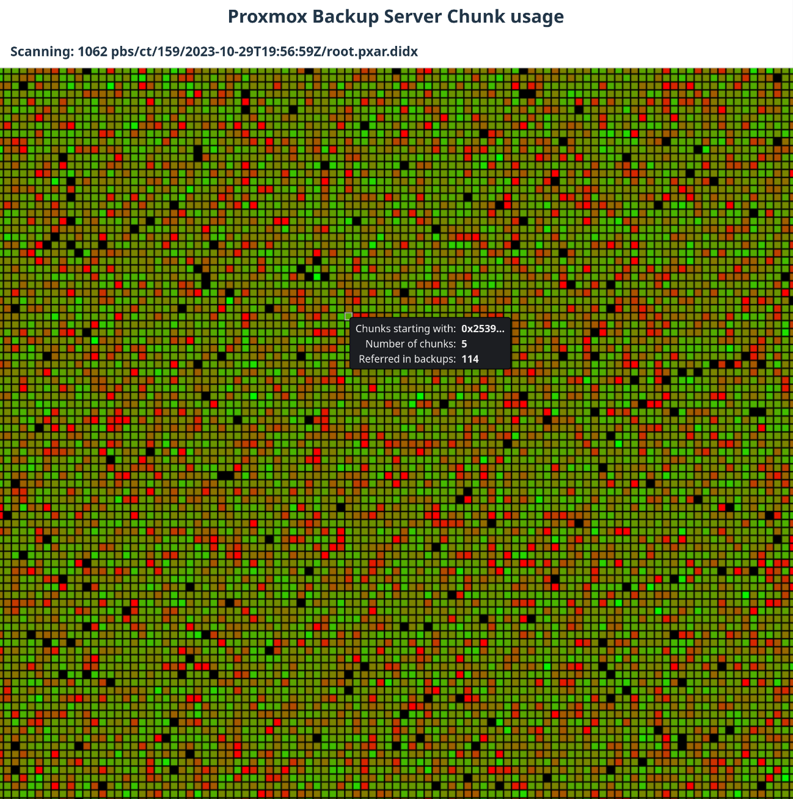

# PBS Stats

This program scans a directory tree for Proxmox Backup Server index files (`.fidx` and `.didx`), analyzes chunk deduplication, and shows chunk usage in a heat map. 



## Features
- Scans all `.fidx` and `.didx` files in a directory recursively
- Counts how often each chunk digest appears across all files


## Usage
```
scan_fidx [--top-chunks N] [--top-files N] <directory>
```
- `--top-chunks N`: Show the top N most referenced chunks (default: 50)
- `--top-files N`: Show the top N files with the highest deduplication ratio (default: 50)
- `<directory>`: Root directory to scan for `.fidx` and `.didx` files

Example

```
./pbsstats /path/to/datastore
```

## About
The program is more of a proof of concept and is not intended for production use. It is designed to help analyze chunk usage in Proxmox Backup Server datasets.
It uses svelte and Go to create a single binary without further dependencies.
